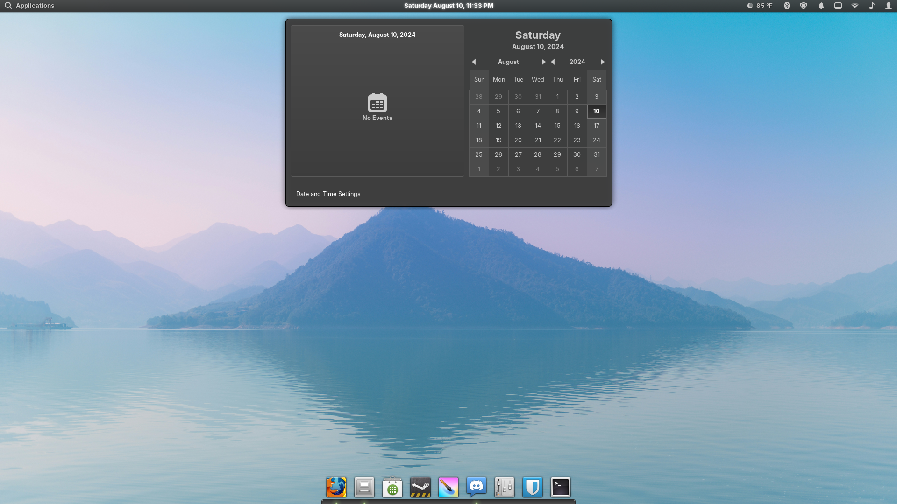

# Cinnamon-XE
A theme for the Cinnamon desktop that combines Mint-X with ElementaryOS



# Install
Open a terminal window and copy the following command (make sure you have a ".themes" folder, it is a hiddle folder btw)

```
cd ~/.themes && git clone https://github.com/goosium/Cinnamon-XE.git
```

To enable the theme, in Cinnamon's system settings, open the Themes option with Advanced settings and set the Desktop theme to Cinnamon-XE


# Not important stuff
Very early development

Based on the "Linux Mint" theme for the Cinnamon Desktop
